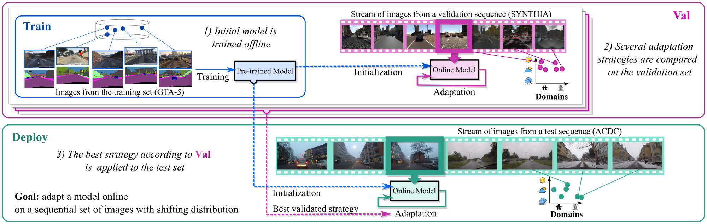

# The OASIS benchmark (CVPR 2022)

[](https://www.python.org/)
[](https://pytorch.org)

A **Pytorch** codebase to support research on **Online Adaptation for Semantic Image Segmentation**.

It contains the code to replicate our [CVPR 2022 paper](https://arxiv.org/abs/2203.16195)'s experiments.



All the datasets used need to be downloaded from the respective website:

- [GTA5](https://download.visinf.tu-darmstadt.de/data/from_games/)
- [SYNTHIA](http://synthia-dataset.net/downloads/)
- [Cityscapes](https://www.cityscapes-dataset.com)
- [ACDC](https://acdc.vision.ee.ethz.ch/login?target=%2Fdownload)

---

## Project structure

- **Data location.** By default, the scripts assume that data is in a folder `./data/DATASET_NAME`, with DATASET_NAME = {GTA5, SYNTHIA, Cityscapes, ACDC}. Note that, once obtained access to download Cityscapes from the [official website](https://www.cityscapes-dataset.com), a further request needs to be forwarded for Foggy/Rainy datasets. 

- **Model location.** Pre-trained models will be stored in `./pre-trained-models/PRETRAINED_MODEL_FOLDER`

- **Experiments location.** Outputs of experiments will be stored in `./adapted-models/PRETRAINED_MODEL_FOLDER/src2trg/TARGET_SEQUENCE/...`

- **Launchers.** The folder `./launchers` contains several scripts that need to be launched, see below.

---

## Dependencies

Python 3.7

pytorch-1.2.0

numpy-1.16.2

pillow-5.4.1

opencv-3.4.2

---

## Train on source

- `train_on_source.py`

Code to train a source model on GTA5. Starting point for further adaptation (run `run_source.sh`).

Note: code to perform data augmentation is missing (work in progress). We will also release the pre-trained models.

---

## Adapt on target sequences

The main script of the project is `main_adapt.py`. To adapt/evaluate a model throughout one target sequence launch:

`python main_adapt.py (--args)`. 

For example, the following command evaluates the NA baseline in an ACDC sequence:

`python -u main_adapt.py --mode=train --trg_dataset=ACDC --scene=GP010476-GP010402-GP030176-GP010376 --cond=fog-rain-snow-night --model_arch=Deeplab --adapt_mode=no-adaptation --restore_from=/PATH/TO/PRETRAINED/SOURCE/MODELS/*.pth`

The folder `./launchers` contains different scripts to generate the commands required to re-train all the methods detailed in the main paper. For example, the script `run_no_adapt.py` generates the command lines to replicate the NA results. 

### Main experiment parameters

   **--model_arch**: Which architecture to use. Type: `str`. Supported: {`DeepLab`}
   
   **--src_dataset**: Which source dataset to start from. Type: `str`. Supported: {`GTA5`}
	
   **--batch_size**: Number of images from the target stream received by the network in one step (fixed to 1 in all ours experiments). Type: `int`.
   
   **--seed**: Random seed for the experiment. Type: `int`.
	
   
   **--models_dir**: Where to save trained models. Type: `str`.
   
   **--restore_from**: Path to .pth source model. Type `str`.

### Target sequence's hyper-parameters

Note: we refer to `run_exp_helpers.py` for all the possible options/combinations.

   **--trg_dataset**: Which target dataset to transfer to. Type: `str`. Supported: {`SYNTHIA`, `Cityscapes`, `ACDC`}")
	
   **--trg_data_dir**: Directory of target dataset chosen. Type=`str`.
	
   **--scene**: String to define the differen envinronments explored in the chosen sequence. Type=`str`. Example for SYNTHIA, `01-04-05`

   **--cond**: String to define the differen conditions explored in the this sequence. Type=`str`. Example for SYNTHIA, `SUMMER-NIGHT-DAWN`


### For adaptation methods

   **--adapt_mode**: Which method to use to adapt the network. Type: `str`. Options: {`no-adaptation`, `batch-norm`, `naive-batch-norm`, `tent`, `naive-tent`, `class-reset-tent`, `oracle-reset-tent`, `pseudo-labels`, `naive-pseudo-labels`, `class-reset-pseudo-labels`, `oracle-reset-pseudo-labels`}
  
   **--batch_norm_momentum**: Momentum for the BN layers. Type: `float`.
   
   **--adapt_iters**: How many staps to carry out for iterative adaptation methods. Type: `int`
	
   **--learning_rate**: Learning rate for iterative adaptation methods. Type: `float`
	
   **--reset_thrs**: Threshold for resetting the model ($\hat{\psi}$ in main paper. Type: `float`.

   **--src_iters**: How many source samples to mix with in the current update, for source regularization methods. Type: `int`.

   **--wct2_random_style_transfer**: Use images pre-processed with WCT2 (Random). Type: `bool`
   
   **--wct2_nn_style_transfer**: Use images pre-processed with WCT2 (NN). Type: `bool`.

### Utils

- `transformation_ops.py`

Code to handle data augmentation, from other [open-sourced project](https://github.com/ricvolpi/domain-shift-robustness).

- `datasets/acdc_dataset.py`, `datasets/cityscapes_dataset.py`, `datasets/gta5_dataset.py`, `datasets/synthia_dataset.py`

Code to define dataloaders for the differenet datasets (GTA-5, Cityscapes A.W., Cityscapes O., ACDC).

- `metrics_helpers.py`

Code that contains functions to support testing operations.

- `image_helpers.py`

Code that contains functions to support saving/processing images.

---

## Visualizing the results

The file `streamlit-app.py` contains the source code for the [Streamlit](https://streamlit.io) web app we used to manage our experiments. Run `run streamlit streamlit-app.py` after having installed Streamlit, and after having launched `bash run_before_using_streamlit.sh`.

Some finished experiments must be in the `./adapted-models/PRETRAINED_MODEL_FOLDER/src2trg/TARGET_SEQUENCE/...` directories, otherwise the app will not show any result.

Note: tested on `streamlit-0.74.1`.

---

## Pre-trained models

Links to download the models pre-trained on [GTA5](https://download.visinf.tu-darmstadt.de/data/from_games/) with different levels of domain randomization. Please, note that models trained on GTA5 are for "research and educational purposes only. Commercial use is prohibited". See our [license file](https://github.com/naver/oasis/blob/master/LICENSE-OASIS.txt) for the details.

- [ERM](https://download.europe.naverlabs.com/oasis/erm_model.pth) 
- [DR1](https://download.europe.naverlabs.com/oasis/dr1_model.pth)
- [DR2](https://download.europe.naverlabs.com/oasis/dr2_model.pth) (best on validation)
- [DR3](https://download.europe.naverlabs.com/oasis/dr3_model.pth)

---

## Evaluating and comparing models

After models have been adapted on all the sequences from the OASIS benchmark, launch the Streamlit app.

The button "Compute results" on the left allows processing the result files in each experiment-folder contained in `./adapted-models`. Once it has finished, it generates a pkl file (`new_results.pkl`). 

The script `./tex_tables/make_tables.py` allows processing such results and comparing them with the ones we published in our CVPR 2022 paper. 

Note that, if a new method is implemented (for example, on `main_adapt.py`), the code to retrieve the results needs to be included in `streamlit-app.py` and `./tex_tables/make_tables.py`. Hopefully, this should not be too difficult by following the code to process the already available methods.

---

## Reference

**On the Road to Online Adaptation for Semantic Image Segmentation** (to appear at CVPR 2022)  
Riccardo Volpi, Pau de Jorge, Diane Larlus and Gabriela Csurka
```
    @InProceedings{Volpi_2022_CVPR,
    author = {Volpi, Riccardo and de Jorge, Pau and Larlus, Diane and Csurka, Gabriela},
    title = {On the Road to Online Adaptation for Semantic Image Segmentation},
    booktitle = {The IEEE Conference on Computer Vision and Pattern Recognition (CVPR)},
    month = {June},
    year = {2022}
    }
```
